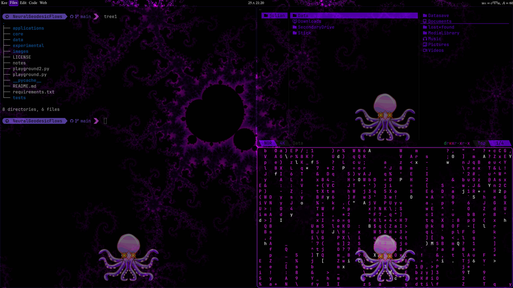
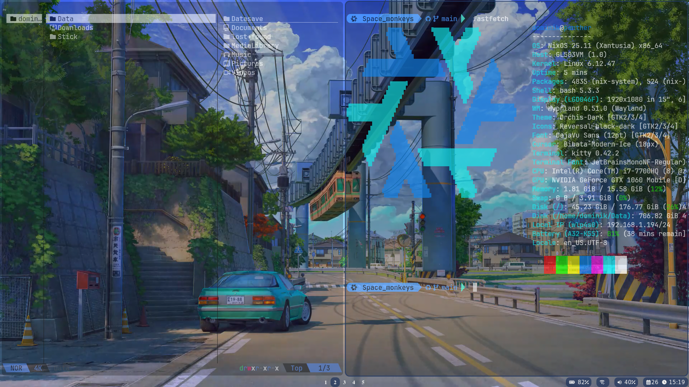

# My NixOS
This is my personal NixOS setup as a Nix project which by its fully declarative nature makes the setup trivially reproducible.

<p align="center">
    
</p>

## Overview
The system is made for easy deployment for different hosts/users. To this end it is completely modular. Below is the default setup.

Base environment:
 * [Hyprland](https://github.com/hyprwm/Hyprland) (highly customizable dynamic tiling window manager with GPU rendering with the latest wayland features) 
 * [Waybar](https://github.com/Alexays/Waybar) (status bar for wayland)
 * [wofi](https://github.com/SimplyCEO/wofi) (app launcher for wayland).
 * [swww](https://github.com/LGFae/swww) (efficient animated wallpaper daemon for wayland)
 * [mpvpaper](https://github.com/GhostNaN/mpvpaper) (wayland video wallpaper program based on mpv)
 * [dunst](https://github.com/dunst-project/dunst) (lightweight notification daemon for wayland)
 * [starship](https://github.com/starship/starship) (minimal, blazing-fast, and infinitely customizable prompt for any shell)

The heart piece of my workflow for programming and creating documents with LaTeX:
 * [kitty](https://sw.kovidgoyal.net/kitty/) (fast feature-rich GPU based terminal) 
 * [neovim](https://github.com/neovim/neovim) (terminal based highly configurable text editor)

Basic apps:
 * [Yazi](https://github.com/sxyazi/yazi) (blazingly fast terminal file manager)
 * [zathura](https://github.com/pwmt/zathura) (functional document viewer with an extremely minimal design) 
 * [mpv](https://github.com/mpv-player/mpv) (free terminal media player)
 * [Zarumet](https://github.com/Immelancholy/Zarumet) (terminal client for mpd written in Rust, similar feel to yazi)

Onlineness:
 * [Gnome-secrets](https://gitlab.gnome.org/World/secrets) (Gnome's GTK password manager using the KeePass v.4 format)
 * [KeePassXC]() (https://keepassxc.org/) (no-nonsense, ad-free, tracker-free, and cloud-free, free and open source password manager written in C++)
 * [Thunderbird](https://www.thunderbird.net/en-US/) (privacy focused open source email client from Mozilla)
 * [Firefox](https://github.com/mozilla-firefox/firefox) (Mozilla's web browser)

Additional:
 * [Audacity](https://github.com/audacity/audacity) (easy-to-use, multi-track audio editor)
 * [GIMP](https://www.gimp.org/) (cross-platform image editor)

 * [Steam](https://store.steampowered.com) (gaming platform)

## Usage
The systems aims to be minimal and elegant. To this end many things (such as connecting to wifi and changing audio devices) is done in terminal. Find an easy explanation of how to in the [wiki](https://github.com/julianbuerge/.mynixos/wiki).


### Setup
Assuming you are on a computer with NixOS and with git installed, clone this repository to `$HOME/.mynixos`. Navigate into it. You will need to adapt the system and the home configuration to use your computer as a new host with your user as a new user. 

Before we begin two comments:
 * I use the Swiss keyboardlayout. If you want another one, go edit it in `modules/system/nixos-options.nix` and also in `home/dotfiles/shared/hyprland/keyboard-inputs.conf`. In the future this will be handled more conveniently with a variable.
 * I am not sure about UEFI/BIOS bootmodes. I just know that the config works on all my machines. I plan to find out and make an appropriate variable soon. 
 
First on a system level. Copy the directory `hosts/template` to `hosts/examplehostname` where `examplehostname` is the name you want your machine to have. You will need edit one of the files and add a new one. Optionally you can edit several more files:
 1. Copy `/etc/nixos/hardware-configuration.nix` into the directory. This is the hardware configuration that NixOS automatically created during install and is unique to your machine. 
 2. Edit `host-variables.nix` by setting all the variables (hostname, username, use_nvidia, ...).
 3. OPTIONALLY edit `filesystems.nix` by uncommenting the code and specifying what additional drives should get mounted automatically at startup.
 4. OPTIONALLY add something to `additional-options.nix` (none by default).
 5. OPTIONALLY add packages to `additional-packages.nix` (none by default).
 6. OPTIONALLY modify the imports in `host-modules.nix` (the setup is completely modular, here is where you choose what modules will be installed. By default you can leave it as is).

With the new host ready you need to tell the system flake `flake.nix` about it. In `flake.nix` add the new host to `nixosConfiguration` like this :
```
examplehostname = setup_host_with_hostname {
        inherit nixpkgs;
        hostname = "examplehostname";
      };
```

The process for adding a new user home configuration is analogous. Copy the directory `home/users/template` to `home/users/exampleusername` where `exampleusername` is the name of the user. You will need edit one of the files.
 1. Edit `user-variables.nix` by setting all the variables.
 2. OPTIONALLY modify the imports in `home.nix` (the setup is completely modular, here is where you decide what dotfile modules to use. By default you can leave it as is).

With the new user ready you need to tell the home flake `home/flake.nix` about it. In `home/flake.nix` add a new line to `homeConfigurations`:
```
exampleusername = setup_user_with_username {
        inherit pkgs;
        inherit home-manager;
        inherit nvf;
        username = "exampleusername";
      };
```
After having completed these steps stash all the changes with `git add *`. Now you are ready to rebuild the system. Do
```
sudo nixos-rebuild switch --flake .#examplehostname
```
and afterwards you can apply the home configuration with
```
home-manager switch --flake ./home#exampleusername
```
Reboot for all the changes to apply. Start Hyprland simply by doing `hyprland`. Perhaps the resolution will be off, that is because Hyprland needs to be told which monitors to use. To see what options are available, open a terminal with Super Enter, and do
```
hyprctl monitors
```
You'll see something like
```
Monitor DP-2 (ID 0):
	2560x1440@143.85600 at 0x0
    ...
```
Go to `home/dotfiles/shared/hyprland/hosts` and make a copy of the directory `template`. Rename it to `hostname`. Enter the new directory, open `hyprland-monitors.conf` and put the name of your chosen monitor (in my example it is DP-2) into it, like so
```
monitor=DP-2,preferred,auto,1
```
Logout with Super Esc and start Hyprland anew. Now you should be ready to go! The most important shortcuts are
 * Super Enter ~ Open terminal
 * Super E ~ Open file manager
 * Super R ~ Open applauncher
 * Super Q ~ Close window

### Updating
In order to update the system and packages available do
```
nix flake update
```
and then rebuild to actually update them.

### Cleaning up
Since NixOS stores all previous builds one may want to clean up older versions from time to time. To do this do
```
nh clean all --keep N
```
This will delete all previous versions (when doing rebuild switch the next time) except the N most recent.

## Rices

There are different looks available for the same set of programs. One can switch between looks by setting the relevant variable in `hosts/hostname/variables.nix`.

### Fractal Rice
This is my main rice. It is themed around mathematics and scientific work, based on terminal, LaTeX and coding workflow. I've create the fractal background images myself. The kitty window logo image is attributed to [Octopus Png PNGs by Vecteezy](https://www.vecteezy.com/free-png/octopus-png) with some color adjustments.
<p align="center">
    
</p>

### City Rice
Transparent style with soft blue ui and a animated city background. Since the background video is large it is not included in the repo but must be manually downloaded and placed at `home/hosts/dotfiles/city-rice/backgrounds/city.mp4`. I've used [this video](https://moewalls.com/lifestyle/japan-summer-train-live-wallpaper/).
<p align="center">
    
</p>

